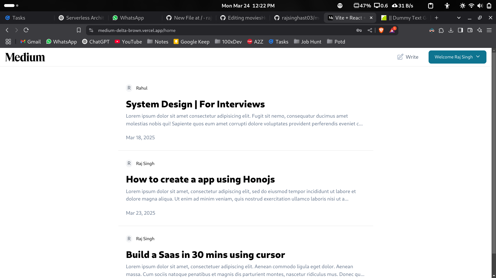

<br/>
<p align="center">
  <a href="https://github.com/rajsinghast03/medium">
    
  </a>

  <h3 align="center">Medium</h3>

  <p align="center">
   Write your articles here!
    <br/>
    <br/>
  </p>
</p>


## About The Project



* Developed a Medium-like blogging platform enabling users to create, read, update, and delete articles
* Implemented Hono.js and Cloudflare Workers for a lightweight, high-performance backend
* Utilized Prisma ORM for efficient database management and Neon DB as a scalable, serverless Postgres solution
* Optimized performance and improved security by leveraging TypeScript’s static typing and edge computing


### Prerequisites


* npm

```sh
npm install npm@latest -g
```

### Installation

1. Get your free Postgres Url at [https://neon.tech]

2. Clone the repo

```sh
git clone https://github.com/rajsinghast03/medium.git
```

3. Install NPM packages

```sh
npm install
```
4. Edit the wrangler.jsonc file inside the backend folder

5. Enter your DB_URL and JWT_SECRET in `wrangler.jsonc` as

```JS
"vars": {
    "DATABASE_URL": "",
    "JWT_SECRET": ""
  }
```

## Contributing

Contributions are what make the open source community such an amazing place to be learn, inspire, and create. Any contributions you make are **greatly appreciated**.
* If you have suggestions for adding or removing projects, feel free to [open an issue](https://github.com/rajsinghast03/moviesHub/issues/new) to discuss it, or directly create a pull request.

### Creating A Pull Request

1. Fork the Project
2. Create your Feature Branch (`git checkout -b feature/AmazingFeature`)
3. Commit your Changes (`git commit -m 'Add some AmazingFeature'`)
4. Push to the Branch (`git push origin feature/AmazingFeature`)
5. Open a Pull Request


